# DockComponent Plugin Architecture

A revolutionary plugin system that enables true team independence while maintaining seamless integration through message passing.

## 🏗️ Cross-Team Plugin Sharing

```mermaid
graph TD
    subgraph TeamB["🔵 Team B Solution"]
        Editor["Editor<br/>📦 .dockplugin only"]
        ErrorList["ErrorList<br/>📦 .dockplugin only"]
        Output["Output<br/>📦 .dockplugin only"]
        B1["Dashboard<br/>✅ Source + Debug"]
        B2["Charts<br/>✅ Source + Debug"]
        
    end
    
    subgraph TeamA["🟣 Team A Solution"]
        A1["Editor<br/>✅ Source + Debug"]
        A2["ErrorList<br/>✅ Source + Debug"]
        A3["Output<br/>✅ Source + Debug"]
        Dashboard["Dashboard<br/>📦 .dockplugin only"]
        Charts["Charts<br/>📦 .dockplugin only"]
       
    end
    
    TeamA -.->|"Share .dockplugin"| TeamB
    TeamB -.->|"Share .dockplugin"| TeamA

    classDef ownSource fill:#e8f5e8,stroke:#2e7d32,stroke-width:2px
    classDef externalPlugin fill:#fff3e0,stroke:#f57c00,stroke-width:2px
    
    class A1,A2,A3,B1,B2,B3 ownSource
    class Dashboard,Editor,ErrorList,Output,Charts externalPlugin
```



**Key Insight**: Each team works on their own components with full debugging, while importing others' work as compiled plugins.

## 🚨 CRITICAL PLUGIN ARCHITECTURE RULE 🚨

**NEVER CREATE CROSS-COMPONENT DEPENDENCIES!**

Each component MUST be completely isolated. If Component A needs to send a message that Component B also needs to send, **DUPLICATE THE MESSAGE CLASS** in both components. Use the message exporter system to help users copy message contracts, but NEVER create project references between components.
Treat this as REST API. 

❌ **WRONG:** `using DockComponent.Editor.Messages;` in Output component
✅ **RIGHT:** Duplicate the message class in each component that needs it

**DUPLICATE MESSAGES BETWEEN COMPONENTS - NEVER SHARE THEM!**

## 🔑 Key Architectural Features

### **Team Isolation**
- **Team A** works on core IDE features (Editor, ErrorList, SolutionExplorer, Output) 
- **Team B** works on Dashboard & Analytics features
- **Zero shared dependencies** between teams - complete independence

### **Message Contract Copying**
- **📋 Copy/Paste Pattern**: Teams copy message classes from each other's documentation
- **📄 README-driven contracts**: Each component documents its messages for others to copy
- **No shared message libraries** - each team owns their message definitions

### **Development Experience**
- **🔧 Author Mode**: Each team has full debugging access to their own source code
- **🔌 Plugin Integration**: Teams use each other's compiled .dockplugin files  
- **✅ Selective debugging**: Can debug your own components, not others' plugins

### **Communication Layer**
- **🚌 ReactiveUI MessageBus**: Pure JSON message passing
- **Fire-and-forget pattern**: No RPC or tight coupling
- **Convention-based naming**: `{ComponentName}_{MessageName}` format

### **Consumer Experience**
- **🚀 DockTemplate.Empty**: Completely empty shell for end users
- **⚡ Zero-to-Hero Demo**: Transform empty app into full IDE via drag & drop
- **🔒 Plugin-only mode**: No source code access, pure plugin consumption

## 📝 Message Contract Documentation Standard

Every component should document its message contracts in its README.txt file:

```
MESSAGES WE EMIT:
----------------------------------------
1. EditorComponent_FileOpened (v1)
   Data: {"FilePath": string, "FileName": string, "Language": string}
   C# Class: [Provide copy/pasteable code]
   
2. EditorComponent_FileSaved (v1) 
   Data: {"FilePath": string, "DocumentTitle": string}
   C# Class: [Provide copy/pasteable code]

MESSAGES WE CONSUME:
----------------------------------------  
1. ErrorListComponent_ErrorClicked (v1)
   Data: {"FilePath": string, "LineNumber": int, "ErrorMessage": string}
   Action: Opens file and navigates to error line
```

## 🏗️ Plugin Structure (Per Team)

```
DockComponent.{PluginName}/
├── Transport/                     # Messages we interact with
│   ├── EditorComponent/          # Messages we CONSUME from Editor
│   │   ├── FileOpenedMsg.cs     # Copy/pasted from Editor docs
│   │   └── FileSavedMsg.cs      # Copy/pasted from Editor docs  
│   ├── ErrorListComponent/       # Messages we CONSUME from ErrorList
│   │   └── ErrorClickedMsg.cs   # Copy/pasted from ErrorList docs
│   └── {OurComponent}/          # Messages we EMIT  
│       ├── OurMsg1.cs          # Our own message definitions
│       └── OurMsg2.cs          # Published for others to copy
├── ViewModels/
├── Views/
├── README.txt                   # Message contracts & integration guide
└── {PluginName}.csproj         # Self-contained build
```

## 🔄 Development Workflows

### **Author Mode** (DockTemplate):
- Direct project references to plugin source code
- Full debugging and development capabilities
- Can mix source plugins + compiled plugins

### **Consumer Mode** (DockTemplate.Empty):
- Pure plugin loading from .dockplugin files
- Zero source code dependencies
- Demonstrates real-world plugin usage

## 🚀 Real-World Benefits

1. **Team Independence**: No coordination required between teams
2. **Zero Coupling**: Plugins can't break each other
3. **Easy Distribution**: Just share .dockplugin files
4. **Version Flexibility**: Teams control their own evolution

## 🎯 Plugin Communication

### Plugin Communication:
- **Pure message bus** (ReactiveUI MessageBus)
- **JSON serialization** for all data transfer
- **Fire-and-forget** messaging (no RPC)
- **No knowledge** of other plugins' internals

### Example Message Handling:
```csharp
// Sending a message
var message = new ComponentMessage(
    "Editor_FileOpened",
    JsonSerializer.Serialize(new { FilePath = "test.cs", Language = "csharp" })
);
MessageBus.Current.SendMessage(message);

// Receiving a message
MessageBus.Current.Listen<ComponentMessage>()
    .Where(msg => msg.Name == "ErrorList_ErrorClicked")
    .Subscribe(message => {
        var data = JsonSerializer.Deserialize<ErrorClickedData>(message.Payload);
        // Handle the message
    });
```

## 🎪 Demo Power

This architecture enables the ultimate demo experience:

- Start with completely empty shell
- Drop plugins one by one
- Watch full IDE emerge from pure plugins
- Show source vs. plugin integration approaches side-by-side

**This architecture demonstrates that powerful, integrated experiences can emerge from completely independent, loosely-coupled components.**

---

*Built on Avalonia UI, ReactiveUI, and the Dock.Avalonia framework for professional cross-platform desktop applications.*