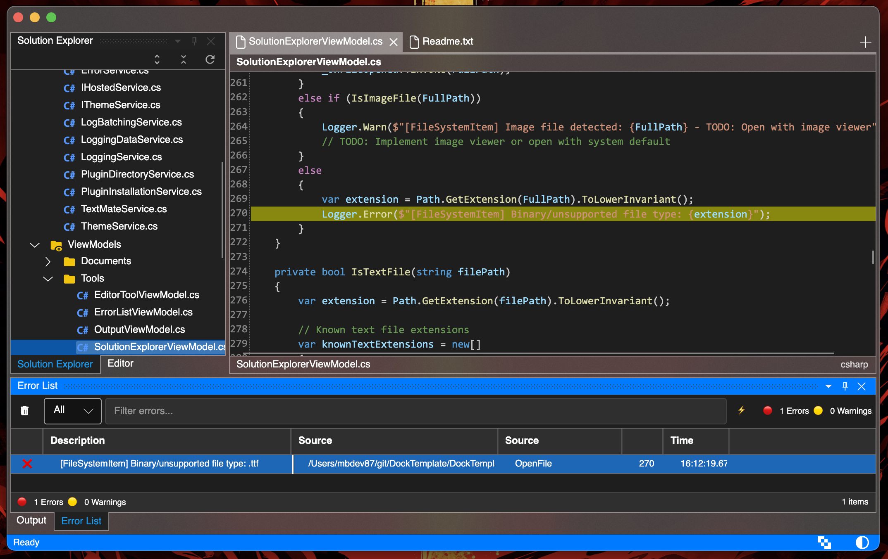
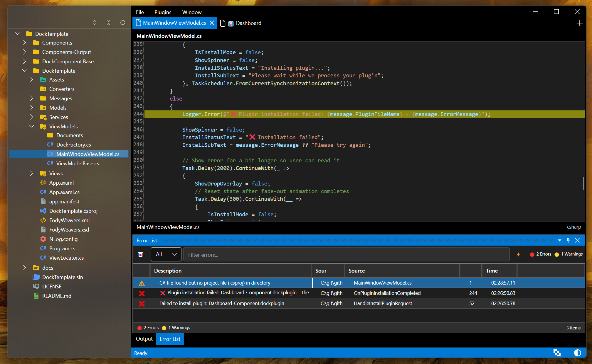

# DockTemplate

**DockTemplate** is a starter framework for building **IDE-style, plugin-driven desktop applications** with [Avalonia](https://avaloniaui.net/).  
It goes beyond simple docking demos by enabling **real collaboration and extensibility** out of the box.

## Why DockTemplate Exists

DockTemplate is more than just a docking demo—it’s built around real-world extensibility and collaboration:

| Benefit                | What It Enables                                                                         |
|------------------------|------------------------------------------------------------------------------------------|
| **Debug as Source**    | Develop plugins as part of your solution—set breakpoints, step through code, and iterate. |
| **Ship as Plugins**    | At build-time, plugins are packaged into standalone `.dockplugin` files for distribution. |
| **Team Collaboration** | Teams can share tools (editors, visualizations, dashboards) without exposing source code. |
| **Loose Coupling**     | Communication via lightweight messages keeps components independent and robust.          |
| **Out-of-the-Box Features** | Includes theming, logging, file explorer, and extensibility points—no need to reinvent basics. |

Imagine DockTemplate as a **cross-platform VS Shell**, sculpted for simplicity, modularity, and cross-team effectiveness.

---

## Quick Start

1. Clone this repo and run the starter app.  
2. Build or grab a `.dockplugin` file.  
3. Drop it into the `Plugins` folder and restart.  
4. Your new tool appears docked and fully functional — no core changes needed.  

---

### Drag & Drop Plugin Installation

https://github.com/user-attachments/assets/188e11d2-7b6a-48a3-9a21-e7755692a52d

*Just drag any `.dockplugin` file onto the application for instant installation with hot-loading*

#### Dashboard

#### Double click on Error to jump to source

#### Cross platform

#### You can dynamically enable/disable effects

Above example with disabled acrylic 

## Current Status

- Complete dockable IDE layout with working panels
- Component system: each control on the UX is fully standalone, loaded or installed! Check DockComponent.Base/README.md file.
- Beautiful Material Design icons with VS Code-inspired colors  
- Real-time logging with filtering (try different log levels!)
- File explorer with intelligent file type recognition
- Light/Dark theme switching
- Solid ReactiveUI + DI architecture
- Charting and data visualization examples in development
- Error List - double click on Error in Errors tab to jump to source
  
**Will there be more?**
Yes, this project will be perpetually expanded with snippets I find useful in my other pet projects. 
Coming soon:
- More real-world integration patterns being added
- .NET template for auto-generation of the base for your tools
- list will be expanded as we go :)

## Built With Amazing Libraries

| Library | Purpose | Why It's Awesome |
|---------|---------|------------------|
| [Avalonia UI](https://avaloniaui.net/) | Cross-platform UI framework | Write once, run everywhere |
| [Dock](https://github.com/wieslawsoltes/Dock) | Dockable layout system | Professional IDE-like interface |
| [Material.Icons.Avalonia](https://github.com/SKProCH/Material.Icons.Avalonia) | Material Design icons | Crisp, beautiful iconography |
| [FontAwesome](https://fontawesome.com/) | Icon system | Reliable icon fallbacks |
| [ReactiveUI](https://reactiveui.net/) | MVVM framework | Modern reactive patterns |
| [AvaloniaEdit](https://github.com/AvaloniaUI/AvaloniaEdit) | Text editor component | Syntax highlighting magic |
| [NLog](https://nlog-project.org/) | Logging framework | Professional logging system | 
| [ScottPlot](https://github.com/ScottPlot/ScottPlot) | Charting library | Very easy to use  |

## Learning Resources

New to Avalonia or the libraries we use? Check these out:

- [Avalonia Documentation](https://docs.avaloniaui.net/)
- [Avalonia Community Tutorials](https://github.com/AvaloniaUI/Avalonia/wiki)
- [Dock Layout Examples](https://github.com/wieslawsoltes/Dock/tree/master/samples)
- [ReactiveUI Documentation](https://reactiveui.net/docs/)

## License

This project is licensed under the **MIT License** - see the [LICENSE](LICENSE) file for details.

## Acknowledgments

Huge thanks to the amazing developers who created the libraries that make this possible:

- **Wiesław Šoltés** for the incredible [Dock](https://github.com/wieslawsoltes/Dock) layout system
- **The Avalonia Team** for building an amazing cross-platform UI framework
- **SKProCH** for the beautiful [Material.Icons.Avalonia](https://github.com/SKProCH/Material.Icons.Avalonia)
- **The ReactiveUI Community** for making MVVM actually enjoyable
- **All contributors** to the open source ecosystem

---
